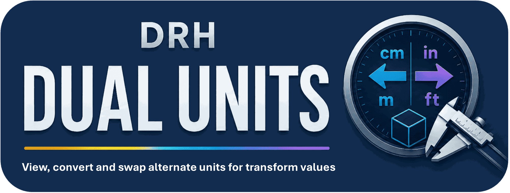
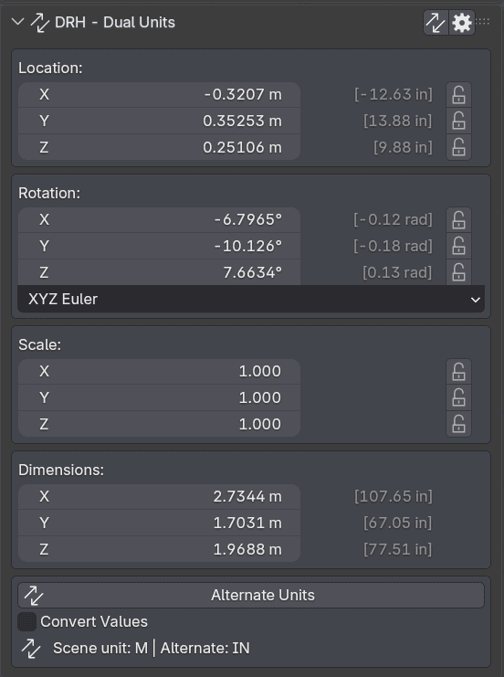
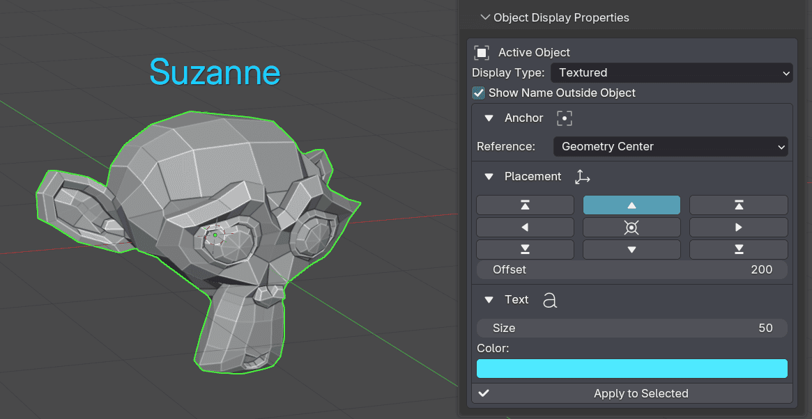
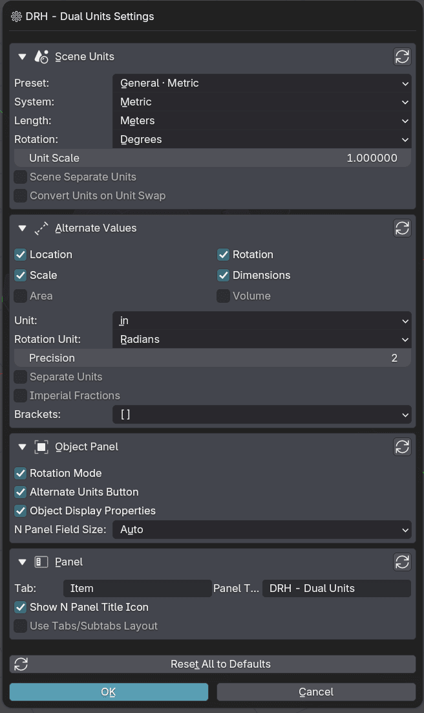

  

 

# DRH - Dual Units

### Public Support Hub · Documentation · Feedback · Available on Blendkit

**Dual-unit transform values and scene measurement tools.**

 

**Part of the DRH Add-ons ecosystem - Blender tools, updates, and releases.**

---

**DRH - Dual Units** helps Blender users review Location, Rotation, Scale, and Dimensions with active scene units and alternate units visible side by side.

This repository is the central public hub for support, documentation, issue tracking, compatibility feedback, and release feedback for DRH - Dual Units.

---

## Support DRH Development

If **DRH - Dual Units** helps you work faster or makes your Blender workflow more reliable, you can support ongoing DRH development on **Ko-fi**. Your contribution helps fund maintenance, Blender compatibility updates, documentation, testing, and the development of new production-focused tools across the DRH ecosystem. Support is completely optional, and bug reports, compatibility feedback, and workflow suggestions are always welcome.

  

[**Support DRH on Ko-fi**](https://ko-fi.com/pacosalasv)

---

  
<strong>📚 Table of Contents</strong>

## Menu

- [Overview](#overview)
- [Media preview](#media-preview)
- [What DRH - Dual Units does](#what-drh---dual-units-does)
- [Key features](#key-features)
- [Full feature list](#full-feature-list)
- [Who is it for?](#who-is-it-for)
- [Current status](#current-status)
- [Feedback and compatibility reports](#feedback-and-compatibility-reports)
- [Quick links](#quick-links)
- [Before you post](#before-you-post)
- [Use Discussions for](#use-discussions-for)
- [Use Issues for](#use-issues-for)
- [Where to post](#where-to-post)
- [Support policy](#support-policy)
- [Technical notes](#technical-notes)
- [Availability](#availability)
- [Documentation](#documentation)
- [LICENSE](#LICENSE)

---

## Overview

**DRH - Dual Units** is a Blender workflow utility designed to make unit review, alternate measurement display, and transform checking faster inside the 3D View N Panel.

It is intended for modelers, makers, 3D printing users, product visualization artists, architecture-adjacent users, asset creators, technical artists, and Blender users who need to move between real-world unit systems or verify object dimensions during production.

Instead of repeatedly changing scene unit settings manually or relying on mental conversions, DRH - Dual Units provides a familiar transform-style panel where scene units and alternate units can be reviewed side by side.

---

## Media preview

<!--

### Demo video

Replace `YOUTUBE_VIDEO_ID` with your real YouTube video ID.

Example:
https://www.youtube.com/watch?v=YOUTUBE_VIDEO_ID

  
   
  Click the image to watch the demo on YouTube.

-->

<!--
### Quick demo GIF

Recommended size: 1280x720 or 960x540.

  

-->

### Screenshots

| Transform Panel Alternate Units | Object Labels and Placement |
|---|---|
|  |  |

  
<strong>More Screenshots...</strong>

| Units and Panel Settings |
|---|
|  |

---

## What DRH - Dual Units does

DRH - Dual Units adds a dedicated Blender sidebar workflow for scene units, alternate unit display, transform review, and object display labeling.

It is designed to emulate Blender’s familiar Transform panel while adding the dual-unit visibility Blender does not provide by default.

Use it to:

- View scene units and alternate units side by side
- Review Location, Rotation, Scale, and Dimensions without manual conversion
- Switch between practical scene unit presets
- Show alternate dimensions, location, and rotation values
- Format alternate values with precision, brackets, and split-unit display
- Swap scene and alternate unit workflows when supported
- Lock and edit transform values from a familiar transform-style interface
- Show or hide rotation mode and scale controls in the panel
- Apply object display settings to selected objects
- Display object names outside object bounds with configurable anchor, position, size, color, and offset
- Reset scene and add-on settings to defaults
- Keep measurement and viewport review tools available from the 3D View UI

---

## Key features

- Familiar transform-style N Panel layout
- Scene unit and alternate unit values shown side by side
- Location, Rotation, Scale, and Dimensions review without manual conversion
- Scene unit presets for metric, imperial, product, architecture, site, carpentry, and 3D printing workflows
- Alternate length units for meters, centimeters, millimeters, kilometers, inches, feet, yards, and miles
- Alternate rotation-unit support
- Precision controls from 0 to 6 decimal places
- Optional split-unit formatting for supported alternate unit families
- Bracket style options for alternate values
- Transform lock and edit workflow
- Object display tools for selected objects
- External object-name overlay controls
- Name anchor, placement, size, color, and offset settings
- Apply-to-selected workflow for object display settings
- Settings popup and reset-to-defaults workflow
- Scene and object property registration for persistent settings
- Local Blender add-on workflow with no external service requirement

---

  
<strong>🧩 Full feature list</strong>

## Full feature list

### Unit Switching & Presets

- Scene unit preset workflow
- Alternate unit workflow
- Preset: Custom
- Preset: General Metric
- Preset: Product Metric
- Preset: Arch Imperial
- Preset: Site Imperial
- Preset: Architecture mm
- Preset: Carpentry
- Preset: 3D Printing
- Swap Scene / Alternate Units operator
- Reset all defaults operator

### Supported Alternate Length Units

- Meters
- Centimeters
- Millimeters
- Kilometers
- Inches
- Feet
- Yards
- Miles

### Preset Behavior

- General Metric: metric meters, degrees, alternate inches
- Product Metric: metric millimeters, degrees, alternate inches
- Architecture mm: metric millimeters, degrees, alternate inches
- 3D Printing: metric millimeters, degrees, alternate inches
- Arch Imperial: imperial inches, degrees, alternate millimeters
- Site Imperial: imperial feet, degrees, alternate meters
- Carpentry: imperial inches with separate units enabled, alternate millimeters

### Measurement Display

- Show alternate dimensions
- Show alternate location values
- Show alternate rotation values
- Show rotation mode controls
- Show scale controls
- Alternate precision controls
- Alternate split-unit display
- Bracket style options
- Alternate rotation-unit selection

### Transform Workflow

- Familiar transform-style panel layout
- Location review
- Rotation review
- Scale review
- Dimensions review
- Lock and edit transform values
- Converted alternate values beside original transform values
- Faster scale checking across metric and imperial workflows

### Object Display Tools

- Active object display-type controls
- Apply selected object display settings
- Show object name outside object bounds
- Name anchor controls
- Name placement controls
- Name size controls
- Name color controls
- Name offset controls
- Viewport overlay redraw/update handling

### Batch & UI Workflow

- Apply selected display and label settings to selected objects
- Settings popup
- Reset all defaults
- Main transform panel
- Properties subpanel
- Scene-level settings stored on the scene
- Object-level label settings stored on each object
- Local viewport draw handler for custom object-name overlays

---

## Who is it for?

DRH - Dual Units is designed for:

- Blender modelers
- 3D printing users
- Makers
- Product visualization artists
- Asset creators
- Technical artists
- Architecture-adjacent Blender users
- Users working with real-world scale
- Users working between metric and imperial references
- Users who need fast unit switching
- Users who want clearer measurement, labeling, and scale-review workflows
- Users preparing models for clients, collaborators, manufacturing references, or technical asset review

---

## Current status

| Item | Details |
|---|---|
| **Status** | 🟢 Released |
| **Current version** | 1.0.0 |
| **Minimum Blender version** | 4.2.0 |
| **Blender location** | N Panel > DRH - Dual Units |
| **Platforms** | Windows, macOS, Linux |
| **Release type** | Free public release |
| **Official distribution** | Blendkit only |
| **Free download on Blendkit** | [DRH - Dual Units](https://www.blendkit.com/asset-gallery-detail/4c29e51b-2fc4-4b44-86f4-20139299b434/) |
| **Support repository** | [DRH - Dual Units Support](https://github.com/pacosalasv/DRH_Dual_Units-Support) |

DRH - Dual Units is free for everyone. Official releases and installable packages are distributed exclusively through Blendkit. This GitHub repository is the public support and documentation hub; it does not host official release packages. Use it for compatibility feedback, bug reports, documentation, and workflow suggestions across supported Blender versions.

---

## Feedback and compatibility reports

This repository is open for public feedback, compatibility reports, support questions, and workflow suggestions across releases.

Feedback is especially welcome on:

- Installation experience
- Blender version compatibility
- Unit preset workflow
- Alternate unit display expectations
- Unit conversion expectations
- Transform panel workflow expectations
- Measurement workflow needs
- Scene scale requirements
- Metric and imperial workflow expectations
- 3D printing use cases
- Modeling and asset preparation needs
- Object-name overlay usefulness
- Label placement, color, size, and offset behavior
- Viewport overlay behavior
- Documentation clarity
- Blendkit listing or download feedback
- Workflow expectations for future versions

Useful feedback examples:

> “I would use this to switch quickly between metric and imperial units.”

> “This is useful for 3D printing scale checks.”

> “I need clearer unit conversion without changing scene settings repeatedly.”

> “This helps confirm object dimensions before export.”

> “The object-name overlay helps during viewport reviews.”

> “This makes real-world scale easier to review.”

---

## Quick links

- [Download DRH - Dual Units free on Blendkit](https://www.blendkit.com/asset-gallery-detail/4c29e51b-2fc4-4b44-86f4-20139299b434/)
- [Support repository](https://github.com/pacosalasv/DRH_Dual_Units-Support)
- [Ask a question in Discussions](https://github.com/pacosalasv/DRH_Dual_Units-Support/discussions)
- [Open a new issue](https://github.com/pacosalasv/DRH_Dual_Units-Support/issues/new/choose)
- [Report a bug](https://github.com/pacosalasv/DRH_Dual_Units-Support/issues/new?template=bug_report.yml)
- [Request a feature](https://github.com/pacosalasv/DRH_Dual_Units-Support/issues/new?template=feature_request.yml)
- [Report a compatibility issue](https://github.com/pacosalasv/DRH_Dual_Units-Support/issues/new?template=compatibility_issue.yml)

---

## Before you post

Please include as much of the following information as possible:

- Add-on version
- Blender version
- Operating system
- Installation method
- Clear steps to reproduce
- Expected result
- Actual result
- Error message, screenshot, or console output when available

For compatibility issues, please also include:

- Blender build type, if known
- Portable or installed Blender version
- Whether the issue happens with a clean Blender configuration
- Unit system involved, if relevant
- Measurement or conversion value involved, if relevant
- Scene scale settings, if relevant
- Alternate unit involved, if relevant
- Whether the issue involves unit presets, alternate measurement display, object labels, viewport overlays, object display settings, scale display, transform locking, or export preparation

---

## Use Discussions for

- Questions
- How-to topics
- Installation help
- Compatibility checks
- FAQ
- Suggestions
- Release feedback
- Blendkit listing or download feedback
- Workflow ideas

---

## Use Issues for

- Confirmed bugs
- Reproducible compatibility problems
- Unit preset problems
- Unit conversion problems
- Alternate value display issues
- Measurement or display issues
- Scene scale issues
- Object label or viewport overlay issues
- Object display setting issues
- Transform lock or edit issues
- Feature requests
- Regressions
- Blendkit listing or download problems
- Documentation errors

---

## Where to post

Open a **Discussion** for:

- General questions
- Setup help
- Workflow advice
- Suggestions
- Release feedback

Open an **Issue** for:

- Confirmed bugs
- Reproducible compatibility problems
- Unit switching failures
- Unit conversion failures
- Measurement or scene scale problems
- Transform display problems
- Object label display problems
- Regressions
- Feature requests
- Documentation problems

---

## Support policy

This repository is a public support hub. The add-on is free and does not require a LICENSE key.

Do not post:

- Private account details
- Confidential production files
- Private client files
- Sensitive system information

If a private file is required to reproduce an issue, please describe the problem first and wait for further instructions.

---

## Technical notes

This add-on is source based, with:

- No obfuscation
- No binary-only content
- No external services
- No account requirements

Local system access may be used only for normal Blender workflows such as saving files, loading assets, exporting data, or using project resources when applicable.

The add-on is intended to work locally inside Blender.

---

## Availability

DRH - Dual Units is **free for everyone**.

Official download and release distribution:

- [Blendkit - Free Download](https://www.blendkit.com/asset-gallery-detail/4c29e51b-2fc4-4b44-86f4-20139299b434/)

Official installable releases are distributed exclusively through Blendkit. This GitHub repository is intentionally kept as a support, documentation, feedback, and issue-tracking hub rather than a release-download mirror.

This GitHub repository remains the central public location for:

- Support
- Documentation
- Issue tracking
- Compatibility reports
- Public feedback
- Release notes

---

## Documentation

- [User Manual](docs/manual/user-manual.pdf)
- [Changelog](CHANGELOG.md)

---

## LICENSE

This repository is distributed under **GPL-3.0-or-later**.

---

### DRH Add-ons

**Blender tools, support, updates, and releases.**

Built for clean workflows, practical utilities, and production-friendly Blender setups.

