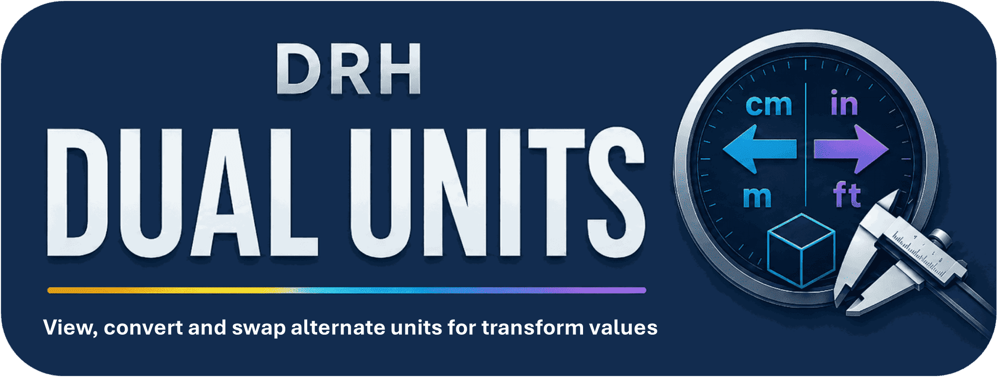

# DRH - Dual Units

**Dual-unit transform values and scene measurement tools**

  

---

## Overview

DRH - Dual Units is a Blender workflow utility designed to make unit review, alternate measurement display, and transform checking faster inside the 3D View N Panel.

It is intended for modelers, makers, 3D printing users, product visualization artists, architecture-adjacent users, asset creators, technical artists, and Blender users who need to move between real-world unit systems or verify object dimensions during production.

## Product status

| Item | Details |
|---|---|
| Status | **Released** |
| Version | 1.1.0 |
| Blender | 4.2+ |
| Platforms | Windows, macOS, Linux |
| Availability | Free public release. |
| Distribution | Official installable releases are distributed through the linked download page. |
| Repository role | Documentation, support, issue tracking, compatibility feedback, and product feedback |

GitHub is used for documentation, support, issues, and release information; installable packages are not mirrored here.

## Capabilities

| Details |
|---|
| Familiar transform-style N Panel layout |
| Scene unit and alternate unit values shown side by side |
| Location, Rotation, Scale, and Dimensions review without manual conversion |
| Scene unit presets for metric, imperial, product, architecture, site, carpentry, and 3D printing workflows |
| Alternate length units for meters, centimeters, millimeters, kilometers, inches, feet, yards, and miles |
| Alternate rotation-unit support |
| Precision controls from 0 to 6 decimal places |
| Optional split-unit formatting for supported alternate unit families |
| Bracket style options for alternate values |
| Transform lock and edit workflow |
| Object display tools for selected objects |
| External object-name overlay controls |
| Name anchor, placement, size, color, and offset settings |
| Apply-to-selected workflow for object display settings |
| Settings popup and reset-to-defaults workflow |
| Scene and object property registration for persistent settings |
| Local Blender add-on workflow with no external service requirement |

## Media

| Preview | Preview |
|---|---|
|  |  |
|  |  |

## Product reference

Open detailed feature reference

## Feature reference

### Unit switching and presets
| Details |
|---|
| Scene unit preset workflow |
| Alternate unit workflow |
| Preset: Custom |
| Preset: General Metric |
| Preset: Product Metric |
| Preset: Arch Imperial |
| Preset: Site Imperial |
| Preset: Architecture mm |
| Preset: Carpentry |
| Preset: 3D Printing |
| Swap Scene / Alternate Units operator |
| Reset all defaults operator |

### Supported alternate length units
| Details |
|---|
| Meters |
| Centimeters |
| Millimeters |
| Kilometers |
| Inches |
| Feet |
| Yards |
| Miles |

### Preset behavior
| Details |
|---|
| General Metric: metric meters, degrees, alternate inches |
| Product Metric: metric millimeters, degrees, alternate inches |
| Architecture mm: metric millimeters, degrees, alternate inches |
| 3D Printing: metric millimeters, degrees, alternate inches |
| Arch Imperial: imperial inches, degrees, alternate millimeters |
| Site Imperial: imperial feet, degrees, alternate meters |
| Carpentry: imperial inches with separate units enabled, alternate millimeters |

### Measurement display
| Details |
|---|
| Show alternate dimensions |
| Show alternate location values |
| Show alternate rotation values |
| Show rotation mode controls |
| Show scale controls |
| Alternate precision controls |
| Alternate split-unit display |
| Bracket style options |
| Alternate rotation-unit selection |

### Transform workflow
| Details |
|---|
| Familiar transform-style panel layout |
| Location review |
| Rotation review |
| Scale review |
| Dimensions review |
| Lock and edit transform values |
| Converted alternate values beside original transform values |
| Faster scale checking across metric and imperial workflows |

### Object display tools
| Details |
|---|
| Active object display-type controls |
| Apply selected object display settings |
| Show object name outside object bounds |
| Name anchor controls |
| Name placement controls |
| Name size controls |
| Name color controls |
| Name offset controls |
| Viewport overlay redraw/update handling |

### Batch and UI workflow
| Details |
|---|
| Apply selected display and label settings to selected objects |
| Settings popup |
| Reset all defaults |
| Main transform panel |
| Properties subpanel |
| Scene-level settings stored on the scene |
| Object-level label settings stored on each object |
| Local viewport draw handler for custom object-name overlays |

## Documentation and support

| Resource | Link |
|---|---|
| User manual | [User manual](docs/manual/user-manual.pdf) |
| Support guide | [Support guide](SUPPORT.md) |
| Manual changelog | [Manual changelog](docs/manual/manual-changelog.md) |
| Product changelog | [Product changelog](CHANGELOG.md) |
| GitHub Discussions | [GitHub Discussions](https://github.com/pacosalasv/DRH_Dual_Units-Support/discussions) |
| GitHub Issues | [GitHub Issues](https://github.com/pacosalasv/DRH_Dual_Units-Support/issues/new/choose) |

Use **Discussions** for questions, setup help, workflow guidance, and general feedback. Use **Issues** for reproducible bugs, regressions, compatibility problems, documentation errors, and focused feature requests.

Before posting, review [SUPPORT.md](SUPPORT.md) for the shared DRH support format and public-information guidance.

## Support DRH development

If this project or another free DRH tool saves you time, optional Ko-fi support helps fund maintenance, Blender compatibility work, documentation, testing, and continued development.

  

## DRH ecosystem

| Destination | Link |
|---|---|
| DRH Add-ons Hub | [Catalog, roadmap, and product status](https://github.com/pacosalasv/DRH_Addons_Hub) |
| Download | [Official download](https://www.blendkit.com/asset-gallery-detail/6fdca217-16ce-4771-bd1f-3aba38f48858/) |
| Paco Salas \| DRH | [GitHub profile](https://github.com/pacosalasv) |
| Support development | [Ko-fi](https://ko-fi.com/pacosalasv) |

## License

See [LICENSE](LICENSE) for repository licensing terms.
